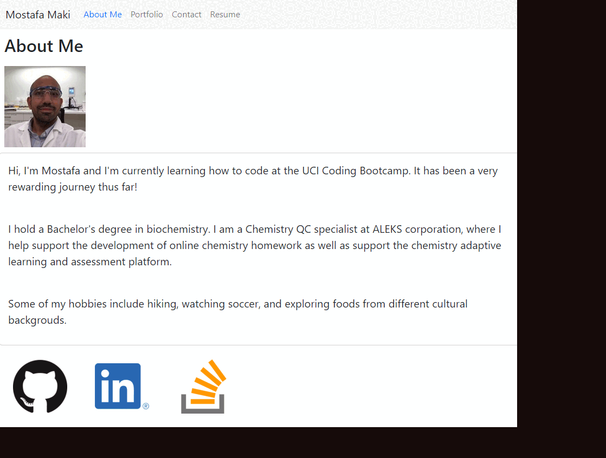

# React Portfolio

## In this application, you will find a simple portfolio built with React. The different pages built in this application loads without the need to refresh the page. Additionally, in the contact me page there is a form section that a use can fill out and the form input has real-time input validation and feedback. The application is live and deployed on GitHub pages.

[Application Link](https://momaki9.github.io/React_Portfolio/)

---

## 

## Table of Contents
  - [Installation](#installation)
  - [Usage](#usage)
  - [License](#license)
  - [Contributing](#contributing)
  - [Tests](#tests)
  - [Questions](#questions)

---
## Installation

A user can clone the files found in this repo then install the required node packages by running `npm i` in the command-line application. Next, either run the command `npm start` in terminal to launch the application locally, or publish the app to GitHub pages.

## Usage

After installing the necessary node packages, and running the application build, the application can be run on a local server or hosted on GitHub pages.

## License

This application is unlicensed

## Contributing

Visit my GitHub or Send me an email

## Tests

There are no tests written at this time

---
## Questions

If you have any questions, please visit my GitHub or send me an email.

[GitHub Link](https://github.com/momaki9)

[Email Me!](mailto:mostafa_m9@yahoo.com)